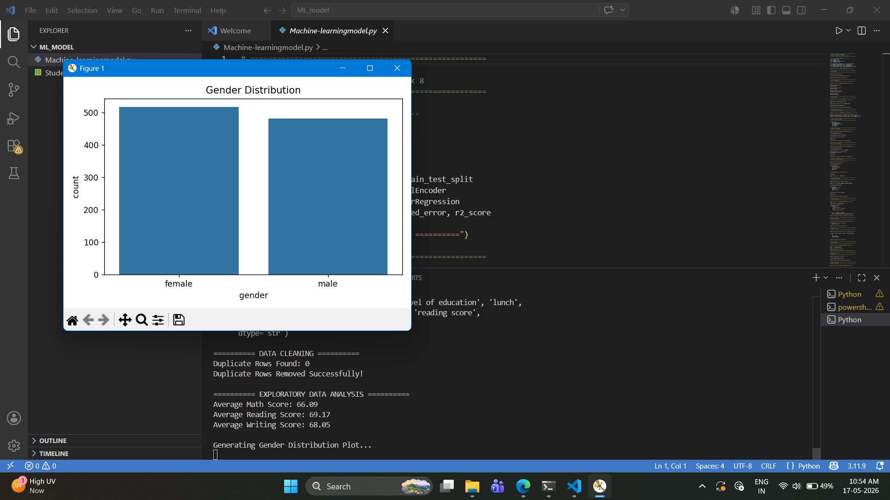
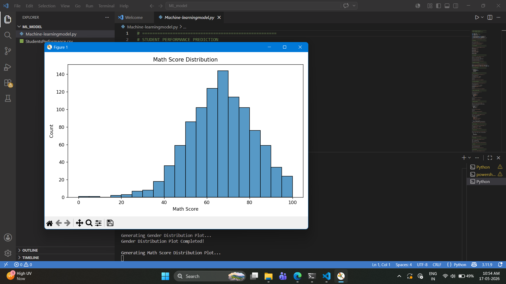
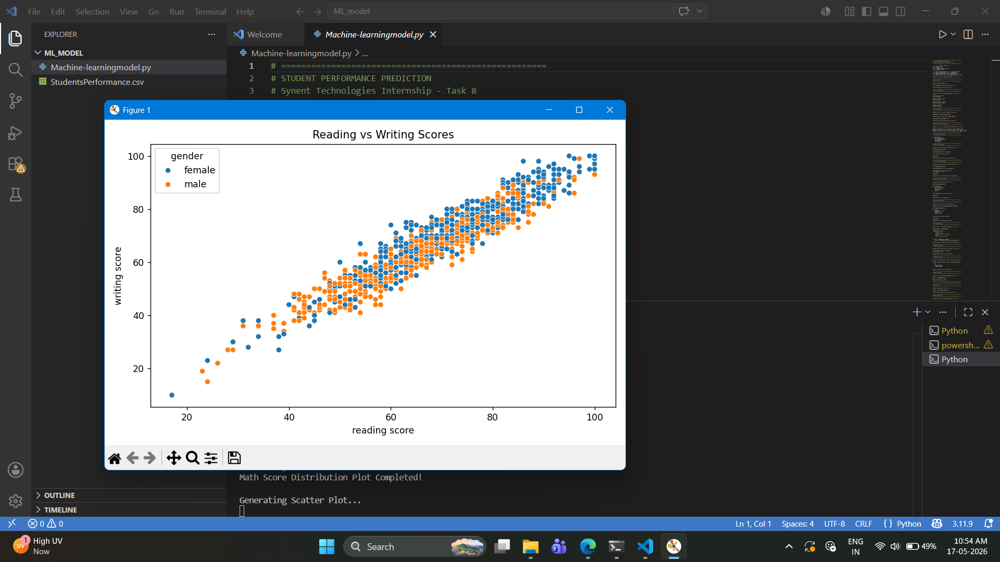
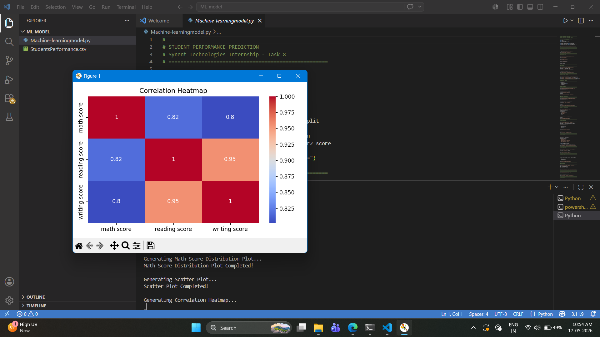
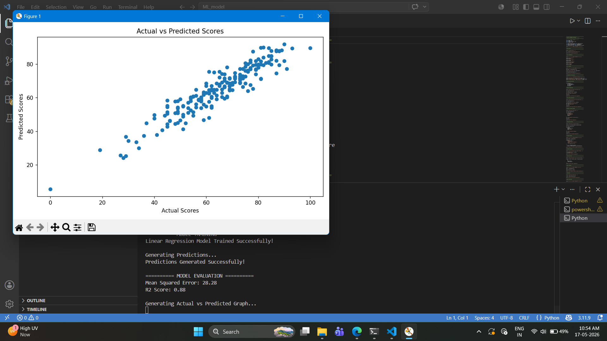

# 🎓 Student Performance Prediction

## ❓ Problem Statement

Educational institutions generate large amounts of student performance data, but identifying the factors that influence academic success can be challenging. This project aims to predict student math scores using Machine Learning techniques by analyzing factors such as reading score, writing score, gender, lunch type, parental education level, and test preparation course.

The project helps in understanding student performance patterns and demonstrates how Machine Learning can be used for predictive analysis in education.

---
https://drive.google.com/file/d/1k3Yu-KvaCxe7C8r7fYbfLBZllY4cNXRx/view?usp=drive_link
---

# 📌 Project Overview

This project focuses on predicting student math scores using Machine Learning techniques. The model analyzes multiple factors such as reading score, writing score, gender, lunch type, parental education level, and test preparation course to predict student academic performance.

The project demonstrates:

- Data preprocessing
- Exploratory Data Analysis (EDA)
- Feature encoding
- Machine Learning model training
- Prediction and evaluation

---

# 🎯 Objectives

The main objectives of this project are:

✔ Analyze student performance data  
✔ Perform data preprocessing and encoding  
✔ Train a Machine Learning model  
✔ Predict student math scores  
✔ Evaluate model performance using metrics  

---

# 🛠 Technologies Used

- Python
- Pandas
- NumPy
- Matplotlib
- Seaborn
- Scikit-learn

---

# 📂 Dataset Details

### Dataset Used
Students Performance Dataset from Kaggle

### Dataset File
`StudentsPerformance.csv`

The dataset contains information related to:

- Student gender
- Race/Ethnicity
- Parental education level
- Lunch type
- Test preparation course
- Math scores
- Reading scores
- Writing scores

---

# 🔍 Approach

The project follows a structured Machine Learning workflow:

1. Data Loading  
2. Data Cleaning  
3. Exploratory Data Analysis (EDA)  
4. Feature Encoding  
5. Train-Test Split  
6. Model Training  
7. Prediction  
8. Model Evaluation  

Python libraries like Pandas, NumPy, Matplotlib, Seaborn, and Scikit-learn were used for preprocessing, visualization, and model development.

---

# 📊 Features Implemented

✔ Data Cleaning  
✔ Feature Encoding  
✔ Exploratory Data Analysis  
✔ Data Visualization  
✔ Train-Test Split  
✔ Linear Regression Model  
✔ Prediction System  
✔ Model Evaluation  

---

# 🤖 Machine Learning Workflow

1. Data Loading  
2. Data Cleaning  
3. Exploratory Data Analysis  
4. Feature Encoding  
5. Train-Test Split  
6. Model Training  
7. Prediction  
8. Model Evaluation  

---

# 📈 Model Evaluation

The model performance was evaluated using:

- Mean Squared Error (MSE)
- R2 Score

---

# 📈 Results & Key Insights

- Reading and writing scores strongly influence math performance.
- Students who completed test preparation tend to perform better.
- Feature encoding improves model training efficiency.
- Linear Regression effectively predicts student scores.
- Data visualization helps identify important academic performance patterns.

---

# 📷 Project Screenshots

## Gender Distribution


## Math Score Distribution


## Reading vs Writing Scores


## Correlation Heatmap


## Actual vs Predicted Scores


---

# 🚀 How to Run the Project

## Step 1: Install Required Libraries

```bash
pip install -r requirements.txt
```

## Step 2: Run the Python File

```bash
python student_prediction.py
```

---

# 📁 Project Structure

```text
STUDENT_PREDICTION/
│
├── README.md
├── requirements.txt
├── student_prediction.py
├── StudentsPerformance.csv
│
└── Screenshots/
    ├── Figure1.png
    ├── Figure2.png
    ├── Figure3.png
    ├── Figure4.png
    └── Figure5.png
```

---

# 👩‍💻 Author

**Nireeksha P**

Computer Science Engineering Student  
Data Science & Machine Learning Enthusiast

---

# ✅ Project Status

✔ Completed Successfully
